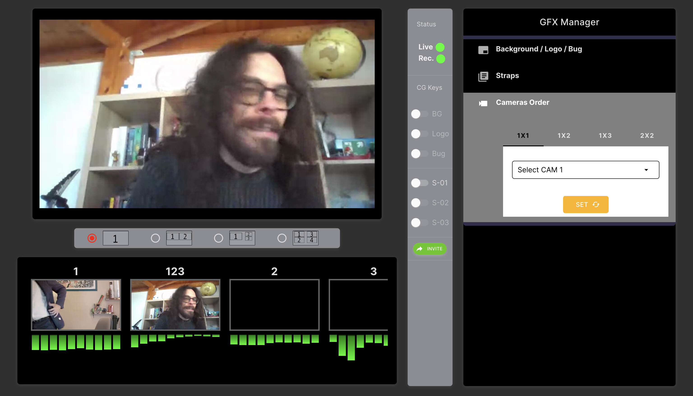
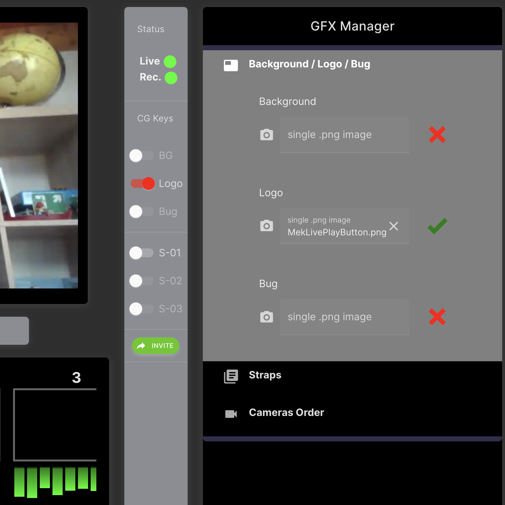
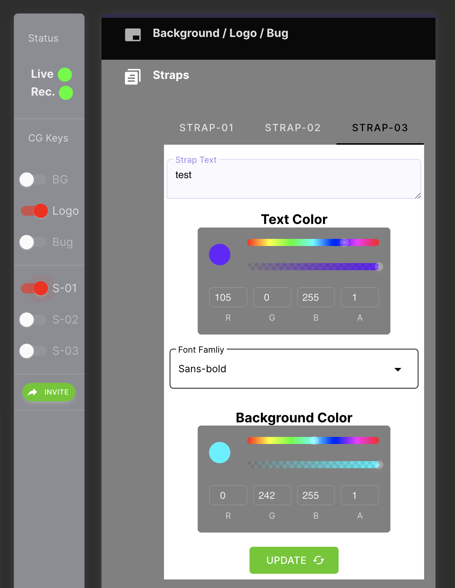
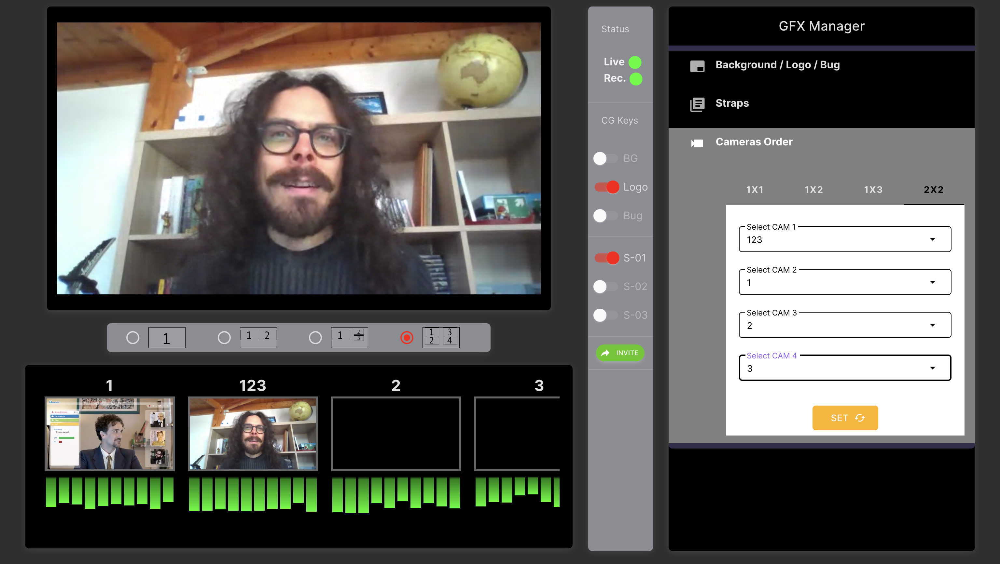

download & unzip
npm install
npm run serve

then add this to your local URL: /webmix/123-test-123

Now you should see an inital verion of the WebMix project dashboard, This is an inital version build for presentation puroses, without any back end and without design.
This project is planed to be something like streamyard, the user will have some live stream played in real time infront of him and he/she can control the final streams like the director within gallery room.
It should also offer some feautre like adding a logo over the final stream or some text with background and controling multi window layout on the final stream.

